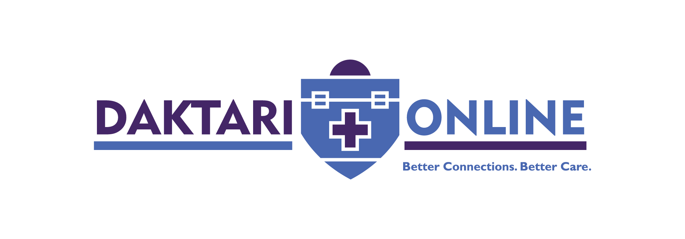

# Daktari Online

**Empowering Healthcare Professionals Across Africa**

[Daktari Online](https://daktarionline.africa) is a digital health platform dedicated to continuous professional development (CPD), knowledge sharing, and community building for healthcare professionals in Kenya and across Africa.

---

## About

Daktari Online bridges the gap between healthcare education and practice by delivering:

- **CPD-Accredited Webinars** — Live and on-demand sessions covering clinical, managerial, and emerging health topics
- **Digital Health Innovation** — Leveraging technology to improve healthcare delivery and patient outcomes
- **Professional Community** — Connecting doctors, nurses, pharmacists, and allied health professionals
- **Healthcare Business Education** — Equipping clinicians with the knowledge to build and sustain health institutions

## Security

We take the security of our platform seriously. If you discover a vulnerability in any project in this organization, please follow responsible disclosure practices and report it to **security@daktarionline.africa** before making it public.

---

*Daktari Online — Continuous Learning for a Healthier Africa.*